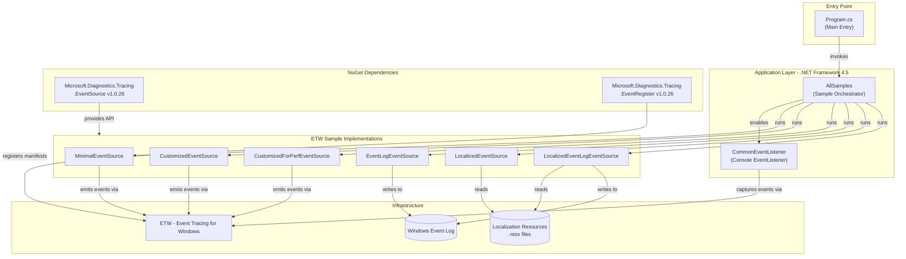
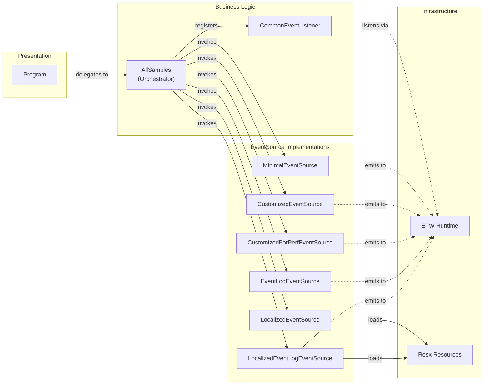

# Architecture Diagram

A .NET Framework 4.5 console application demonstrating ETW (Event Tracing for Windows) patterns using Microsoft.Diagnostics.Tracing.EventSource, with multiple sample implementations and an event listener for console output.

## Application Architecture

## Component Relationships

