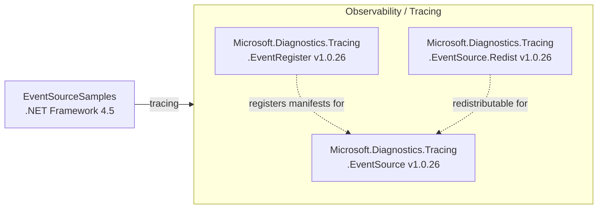

# Dependency Map

The EventSourceSamples project declares 3 external NuGet dependencies, all from the Microsoft.Diagnostics.Tracing namespace, supporting ETW-based event tracing and registration.

## Dependencies

