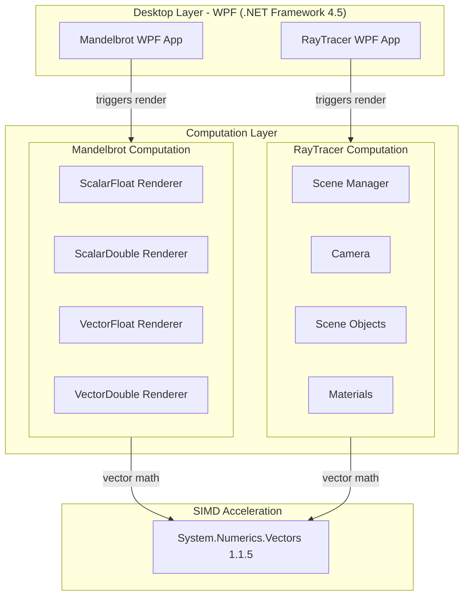
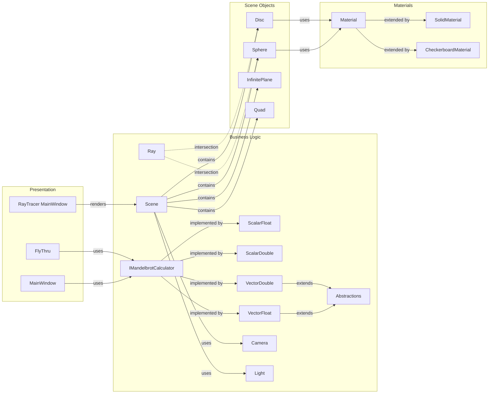

# Architecture Diagram

Two WPF desktop applications targeting .NET Framework 4.5 that demonstrate SIMD (Single Instruction, Multiple Data) acceleration using System.Numerics.Vectors for compute-intensive graphics workloads.

## Application Architecture

## Component Relationships

