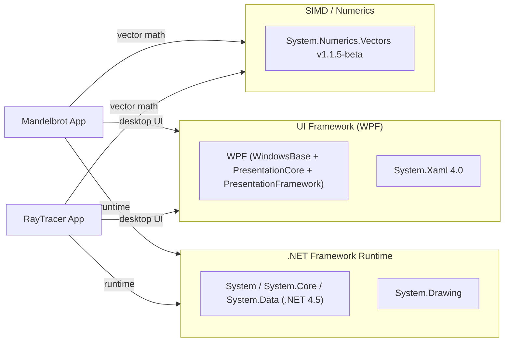

# Dependency Map

The SIMD solution contains two WPF desktop projects (Mandelbrot and RayTracer) targeting .NET Framework 4.5, with a total of 4 external/framework dependencies each relying on System.Numerics.Vectors for SIMD-accelerated computation.

## Dependencies

