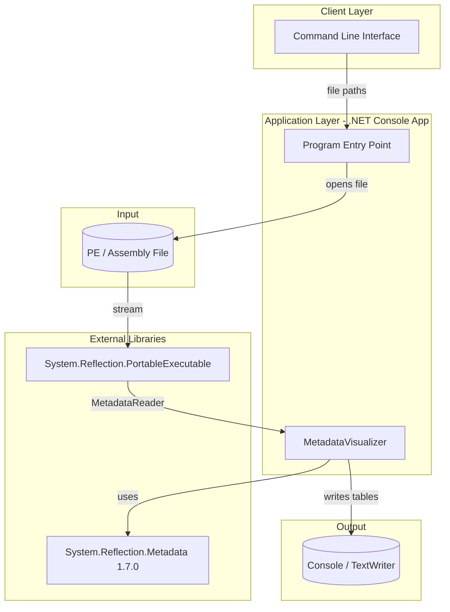
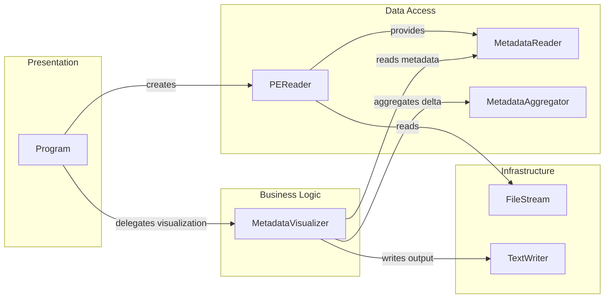

# Architecture Diagram

MdDumper is a .NET console application that reads PE (Portable Executable) files and visualizes all metadata tables using the System.Reflection.Metadata library.

## Application Architecture

## Component Relationships

