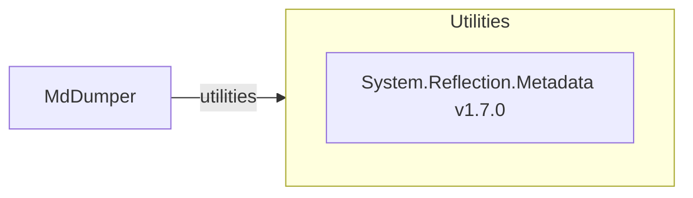

# Dependency Map

MdDumper is a .NET console application with 1 declared external dependency for reading portable executable metadata.

## Dependencies

```mermaid
flowchart LR
    App["MdDumper"]

    subgraph Util["Utilities"]
        SRM["System.Reflection.Metadata v1.7.0"]
    end

    App -->|"utilities"| Util
```
