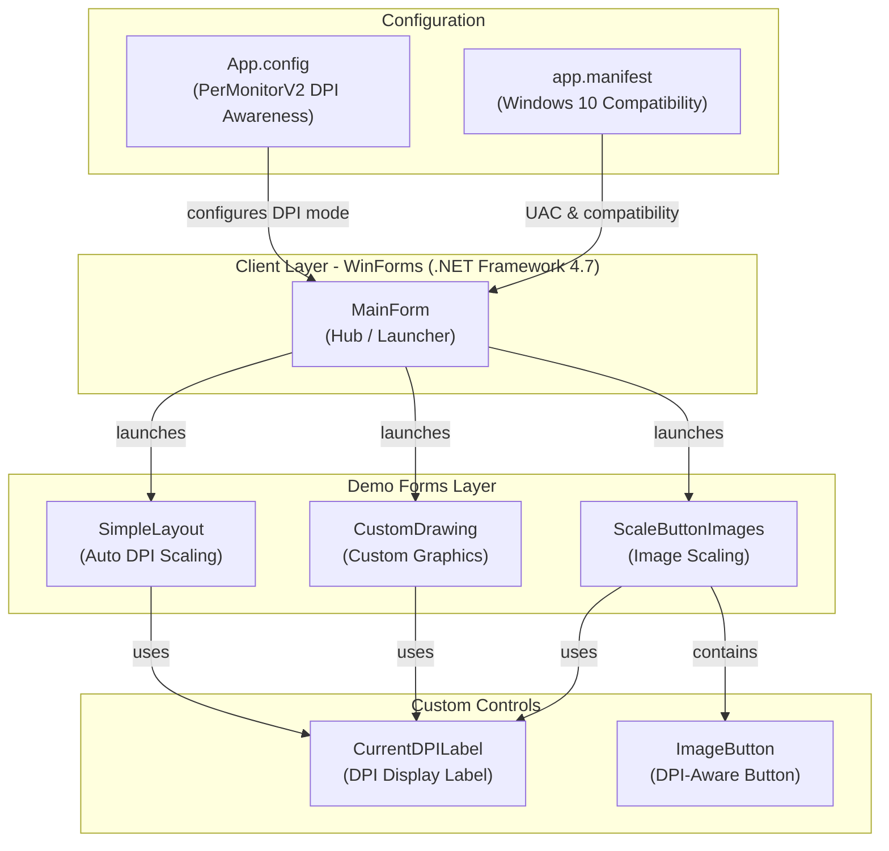
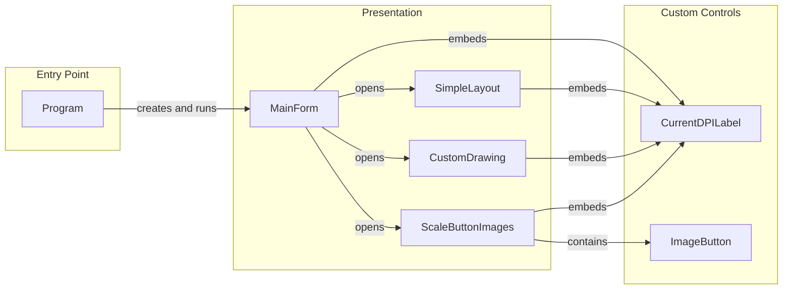

# Architecture Diagram

This WinForms application demonstrates per-monitor DPI awareness techniques across multiple demo forms, each showcasing a different approach to high-DPI scaling.

## Application Architecture

## Component Relationships

