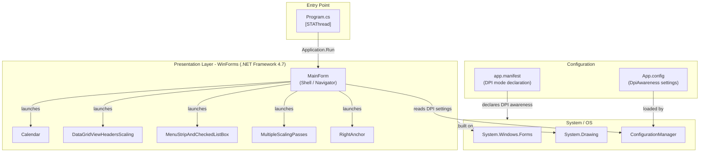
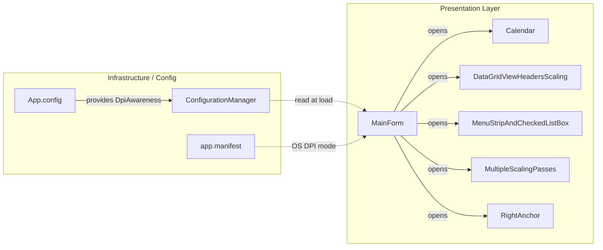

# Architecture Diagram

This is a Windows Forms desktop application targeting .NET Framework 4.7, demonstrating System-Aware High-DPI scaling across multiple UI forms.

## Application Architecture

## Component Relationships

