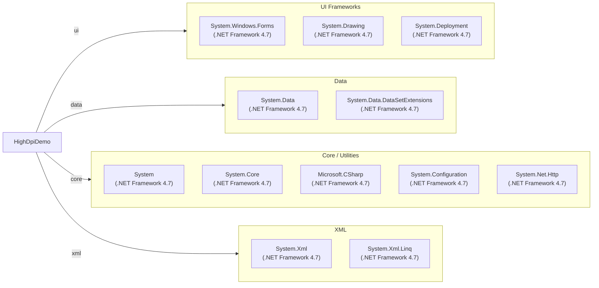

# Dependency Map

HighDpiDemo is a .NET Framework 4.7 WinForms application with 12 framework assembly references and no external NuGet packages.

## Dependencies

```mermaid
flowchart LR
    App["HighDpiDemo"]

    subgraph UI["UI Frameworks"]
        WinForms["System.Windows.Forms\n(.NET Framework 4.7)"]
        Drawing["System.Drawing\n(.NET Framework 4.7)"]
        Deployment["System.Deployment\n(.NET Framework 4.7)"]
    end
    subgraph Data["Data"]
        SystemData["System.Data\n(.NET Framework 4.7)"]
        DataSetExt["System.Data.DataSetExtensions\n(.NET Framework 4.7)"]
    end
    subgraph Core["Core / Utilities"]
        System["System\n(.NET Framework 4.7)"]
        SystemCore["System.Core\n(.NET Framework 4.7)"]
        CSharp["Microsoft.CSharp\n(.NET Framework 4.7)"]
        Configuration["System.Configuration\n(.NET Framework 4.7)"]
        NetHttp["System.Net.Http\n(.NET Framework 4.7)"]
    end
    subgraph XML["XML"]
        SystemXml["System.Xml\n(.NET Framework 4.7)"]
        XmlLinq["System.Xml.Linq\n(.NET Framework 4.7)"]
    end

    App -->|"ui"| UI
    App -->|"data"| Data
    App -->|"core"| Core
    App -->|"xml"| XML
```
